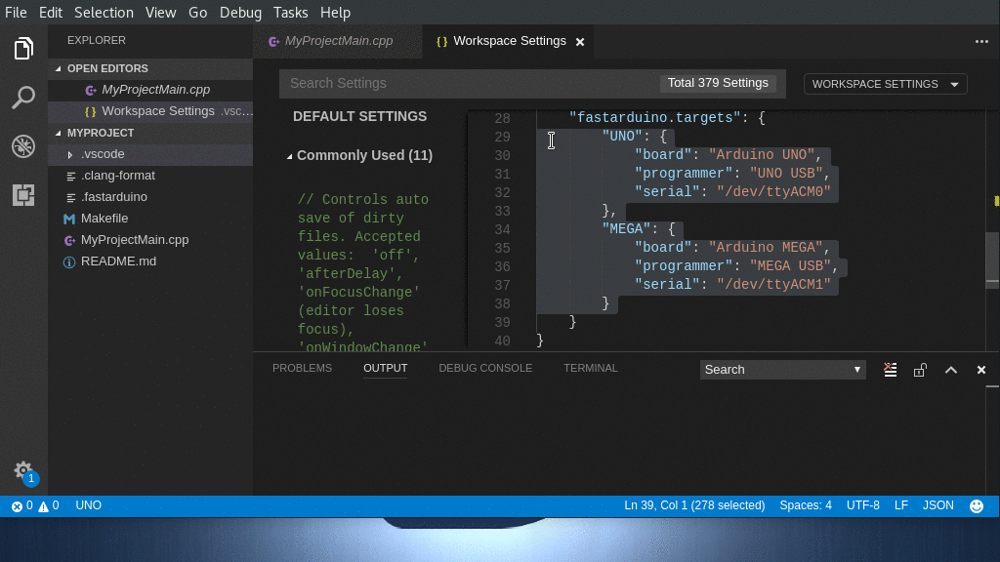
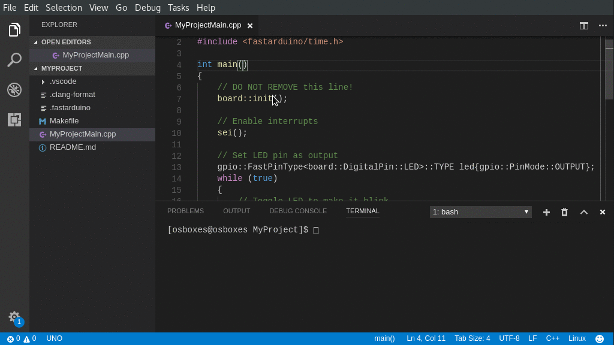

# FastArduino extension for Visual Studio Code

This is the Visual Studio Code extension for developing projects with [FastArduino](https://github.com/jfpoilpret/fast-arduino-lib) library.

This extension makes it easy to write C++ source code of programs for Arduino boards or AVR MCU, as supported by FastArduino library.

In addition, it enables you to build and upload these programs to your target(s).

The extension also supports development of FastArduino library itself.

## Features

FastArduino extension adds an item to the left of the status bar, showing the current target of all tasks. Clicking the item allows you to change that target.

A Target is the combination of:
- a board (or AVR MCU)
- a frequency in MHz (for AVR MCU only)
- a programmer (e.g. board USB, ISP programmer)
- a serial device to which the programmer is connected (if required)

As seen in the animation above, the list of available targets is defined in VS Code settings (also see below).

When a Target has been defined, FastArduino extension dynamically adds the following tasks to the Workspace Folder:

- **FastArduino: Build** builds the current project into a binary ready for upload; this may also generate an EEPROM file that can be further uploaded by the task "FastArduino: Program EEPROM"
- **FastArduino: Clean** cleans all object and binary files created by a previous build
- **FastArduino: Upload Flash** uploads (and builds if needed) the application code from the current project to the specified target
- **FastArduino: Program EEPROM** uploads (and builds if needed) the EEPROM values (extracted from source code) to the specified target; this task may not be available to all targets
- **FastArduino: Program Fuses** reprograms fuses of the specified target; fuses values must be defined in the project settings (see below)

FastArduino extension also adds one task to the Workspace Folder, independently of any target selected:

- **FastArduino: Clean All Targets** cleans all object and binary files created by a previous build, for all targets

As explained further below, FastArduino extension also allows you to substitute target information in some VSCode properties files, based on a kind of template mechanism. The following files are targets of this mechanism:

- `.vscode/c_cpp_properties.json` (generated from a `.vscode/c_cpp_properties_source.json` template file)
- `.vscode/tasks.json` (generated from a `.vscode/tasks_source.json` template file)

## Requirements

This extension currently supports only Linux and Mac platforms.

FastArduino is based on C++, hence this extension will automatically require the installation of the following VSCode extension:
- C/C++

FastArduino relies on [AVR toolchain](http://www.atmel.com/tools/ATMELAVRTOOLCHAINFORLINUX.aspx) for building, hence it must be installed on your machine and added to the `$PATH`.

To properly activate for a Workspace, this extension will search for the existence of a `.fastarduino` file located at your Workspace root directory.

If your project Workspace is a library (rather than an uploadable application), you can add a `.fastarduino.library` file at the Workspace root directory; this serves as a marker file for this extension, so that only "FastArduino: Build" and "FastArduino: Clean" tasks will be added, as any of the "Upload" tasks would not be relevant for a library.

Then, the C/C++ extension must be properly configured for your workspace to use AVR toolchain, through the `c_cpp_properties_source.json` file which shall contain, e.g. for Linux:

    {
        "configurations": [
            {
                "name": "Linux",
                "includePath": [
                    "~/avr8-gnu-toolchain-linux_x86_64/avr/include",
                    "~/avr8-gnu-toolchain-linux_x86_64/avr/include/avr",
                    "${workspaceRoot}/../fast-arduino-lib/cores",
                    "${workspaceRoot}"
                ],
                "defines": ["${VARIANT}", "F_CPU=${AVR_FREQUENCY}", "${AVR_MCU_DEFINE}" ${DEFINES}],
                "intelliSenseMode": "clang-x64",
                "browse": {
                    "path": [
                        "${workspaceRoot}/../fast-arduino-lib/cores",
                        "${workspaceRoot}"
                    ],
                    "limitSymbolsToIncludedHeaders": true,
                    "databaseFilename": ""
                }
            },
            ...
        ]
    }

In this example, `~/avr8-gnu-toolchain-linux_x86_64/` must be changed to the location of the AVR toolchain. This sample also supposes that FastArduino library is checked out at the same level as your project.

Note that `c_cpp_properties_source.json` is not the actual file expected by the C++ extension; in fact this file is used as a "template" by VSCode FastArduino extension to generate the actual `c_cpp_properties.json` used by C++ extension.

In the above example, 4 specific properties are defined in the `defines` array:
- `${VARIANT}`
- `${AVR_FREQUENCY}`
- `${AVR_MCU_DEFINE}`
- `${DEFINES}` this one will contain any additional defines (set in target configuration) to be passed to the compiler

These properties will be automatically replaced by the actual values for the selected target. This will help the C++ extension parse your code with the correct defines for the target you use. You may add your own defines if you need, but you should keep those 3 existing defines here.

For Macintosh, you would normally use the following configuration, here based on the AVR toolchain directly installed along the official Arduino IDE:

    {
        "configurations": [
            {
                "name": "Mac",
                "includePath": [
                    "/Applications/Arduino.app/Contents/Java/hardware/tools/avr/avr/include",
                    "/Applications/Arduino.app/Contents/Java/hardware/tools/avr/avr/include/avr",
                    "${workspaceRoot}/../fast-arduino-lib/cores",
                    "${workspaceRoot}"
                ],
                "defines": ["${VARIANT}", "F_CPU=${AVR_FREQUENCY}", "${AVR_MCU_DEFINE}" ${DEFINES}],
                "intelliSenseMode": "clang-x64",
                "browse": {
                    "path": [
                        "${workspaceRoot}/../fast-arduino-lib/cores",
                        "${workspaceRoot}"
                    ],
                    "limitSymbolsToIncludedHeaders": true,
                    "databaseFilename": ""
                },
                "macFrameworkPath": [
                    "/System/Library/Frameworks",
                    "/Library/Frameworks"
                ]
            },
            ...
        ]
    }

In addition, I use the following extensions for my own developments but they are not mandatory:
- Include Autocomplete
- TODO Highlight
- Auto Comment Blocks

One easy way to create a new project based on FastArduino and use this VSCode extension with all predefined settings is to start with [this project template](https://github.com/jfpoilpret/fastarduino-project-template).

## Extension Settings

FastArduino extension adds the following specific settings to VS Code settings:

- `fastarduino.targets` defines the list of targets (Arduino boards or AVR MCU, programmers, USB devices) for your project. You may define one or more targets (e.g. one for prototyping on UNO and one for the final PCB with an ATmega328).
- `fastarduino.general` defines the default target to use when more than one target has been defined in `fastarduino.targets`.

Here is an example of settings with 2 targets:

    "fastarduino.general": {
        "defaultTarget": "Prototype"
    },
    "fastarduino.targets": {
        "Prototype": {
            "board": "Arduino UNO",
            "programmer": "UNO USB",
            "serial": "/dev/ttyACM0",
            "defines": ["DEBUG"]
        },
        "Product": {
            "board": "ATmega328",
            "frequency": 8,
            "programmer": "ArduinoISP.cc",
            "fuses": {
                "hfuse": "0xDE",
                "lfuse": "0xE2",
                "efuse": "0x05"
            }
        }
    }

Note that for AVR MCU targets, you need to specify their frequency (expressed in MHz).

Specifiying a serial device is optional: when one is needed, you will be required to input it by hand; for some programmers (e.g. the ArduinoISP programmer), no serial device is needed, they get automatically recognized by your system.

In addition, you may define values for the MCU fuses that you may program with the task "FastArduino: Program Fuses".

Finally, you can optionally set some extra `defines` that will be passed to the compiler command-line (with `-D` option).

The list of possible targets are based on FastArduino supported targets; it is defined in the extension's [`fastarduino.json`](https://github.com/jfpoilpret/vscode-fastarduino/blob/master/fastarduino.json).

## Known Issues

No issues have been reported sofar, but any problem or request for enhancement can be submitted to [the project site on GitHub](https://github.com/jfpoilpret/vscode-fastarduino/issues).

## Release Notes

### 0.6.0

- Added possibility to set extra defines, for compiler, in target configuration
- Added possibility to set extra compiler or linker options in target configuration

### 0.5.0

- Fixed issue with "Program Fuses" task: generated make command was wrong
- Fixed issue when selecting a board needing a serial device choice but no device is currently connected
- Added support for ATtinyX5 (to fit FastArduino latest support)
- Updated copyright headers

### 0.4.0

- Now supports only VSCode 1.17 and above
- Extension is not a preview anymore
- Improved serial selection to always allow direct input by selecting "Other..."
- Improved README documentation (mention `.fastarduino` special marker file)
- Uses new VSCode 1.17 Task API
- Added ASL2.0 license and copyright headers to source code files

### 0.3.0

- Fixed source file links in problems panel
- Added variables substitution for `tasks.json` 
- Improved extension design to simplify future enhancements

### 0.2.0

- Fixed bad link to project issues in README.md
- Added automatic set of defines in `c_cpp_properties.json` matching the currently selected target
- Fixed regex for "serial" value in settings, in order to accept Mac devices too.

### 0.1.0

Initial release of FastArduino extension for Visual Studio Code.
